 

  

 

###  Tech I've been working with

 

###  GitHub Stats

 

 

###  Right now

-  Sharpening fundamentals in **Devops, DSA, and core CS concepts**
-  Sketching out app ideas across **AI tools and edtech**
-  Slowly turning side-project ideas into real, shipped code
-  Always up for collabs, study groups, or trading project feedback

 

###  Find me elsewhere

 

